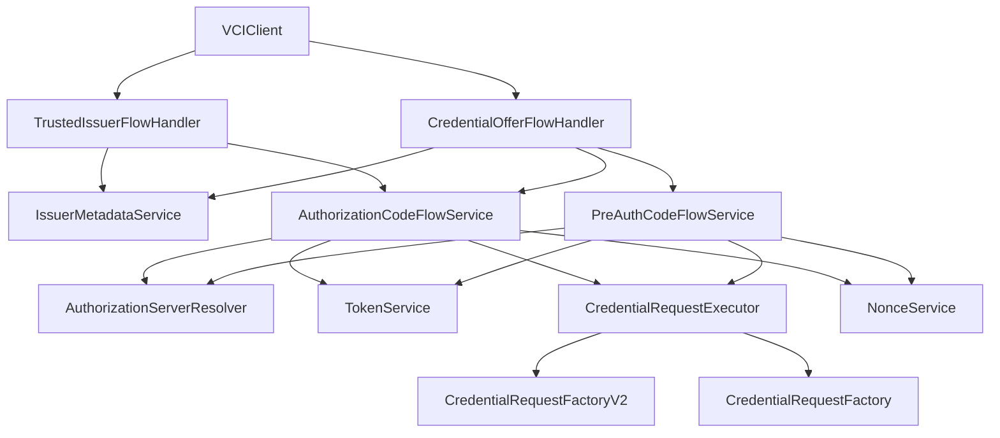
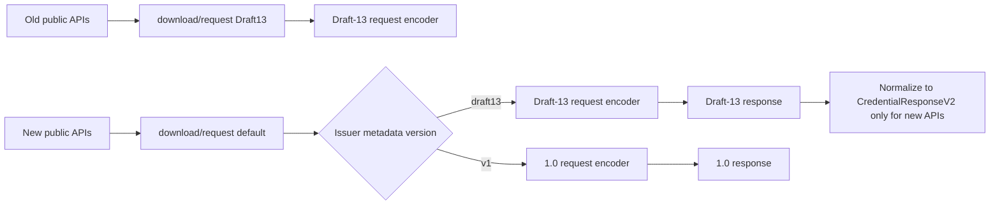
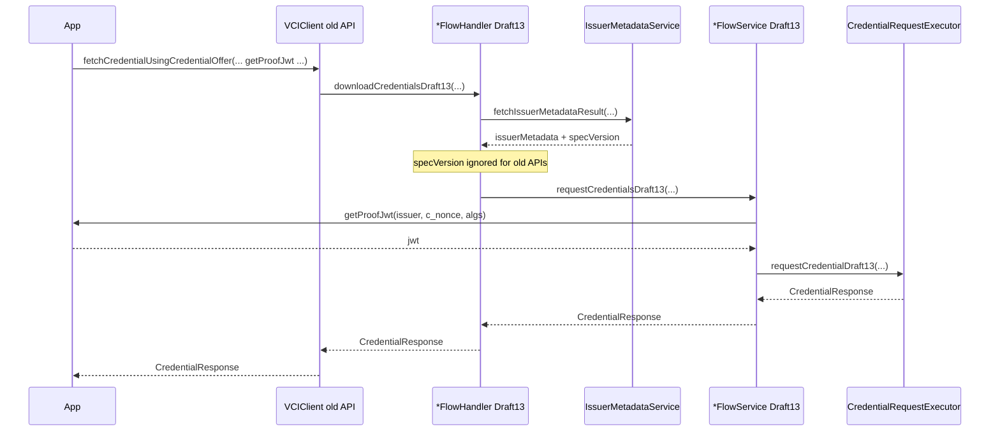
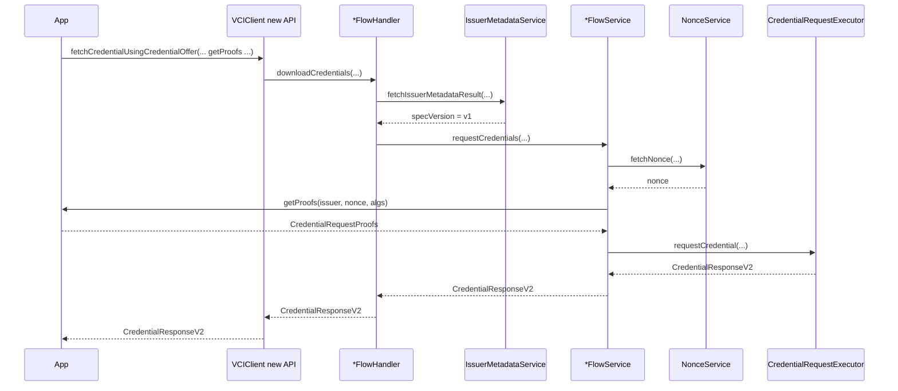
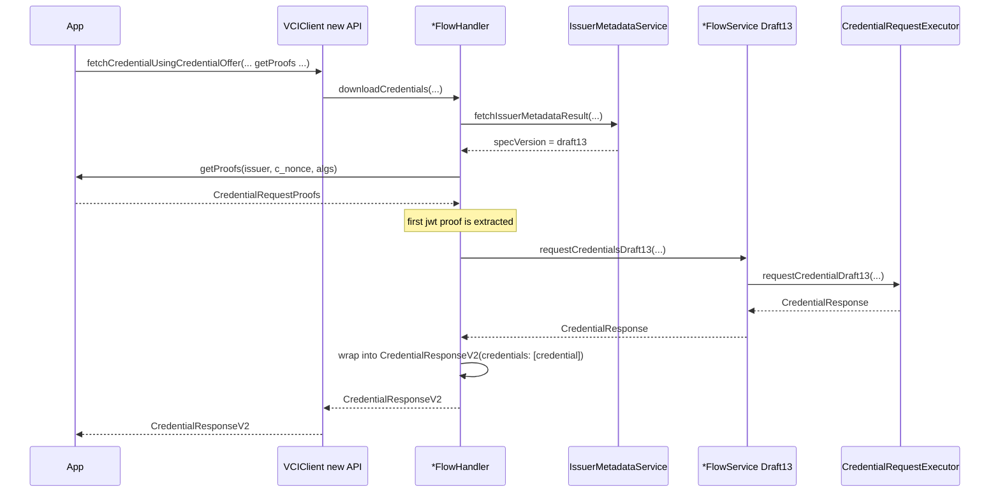

# ADR-0001: OpenID4VCI 1.0 Migration with Draft-13 Compatibility

- Status: Accepted
- Date: 2026-03-30

## Context

`VCIClient` originally implemented an OpenID4VCI Draft-13-style flow:

- single proof callback
- single credential response
- no issuer nonce endpoint handling
- request/response models shaped around Draft-13 assumptions

The library now needs to support OpenID4VCI 1.0 while preserving existing wallet integrations.

The main constraints are:

- existing public APIs are already consumed
- Draft-13 issuers must continue to work
- 1.0 support should not require a heavy rewrite
- internal design should remain close to the existing flow/service/handler architecture

## Decision

The library supports both Draft-13 and OpenID4VCI 1.0 through two public API families and two internal protocol routes.

### Public API split

Legacy APIs remain Draft-13 APIs:

- single proof callback: `ProofJwtCallback`
- single credential response: `CredentialResponse`
- always follow the Draft-13 route, regardless of metadata hints

New APIs are OpenID4VCI 1.0-facing APIs:

- plural proof callback: `ProofsCallbackV2`
- plural credential response: `CredentialResponseV2`
- prefer the 1.0 route
- may internally downgrade to Draft-13 when the issuer is detected as Draft-13

### Internal routing rule

At the internal level:

- the default method names represent the primary 1.0 path
- explicit `Draft13` methods represent the compatibility path
- old public APIs call `Draft13` methods directly
- new public APIs call the default methods and allow metadata-based routing

This keeps the long-term design centered on 1.0 while isolating Draft-13 behavior in clearly named compatibility methods.

## Public interface

### Legacy public APIs

Legacy public APIs continue to return Draft-13-shaped types:

- `fetchCredentialUsingCredentialOffer(... getProofJwt: ProofJwtCallback ...) -> CredentialResponse?`
- `fetchCredentialFromTrustedIssuer(... getProofJwt: ProofJwtCallback ...) -> CredentialResponse?`
- deprecated legacy wrappers also stay on Draft-13

These methods must not switch to the 1.0 path, even if issuer metadata suggests `v1`.

### New public APIs

New public APIs expose 1.0-facing contracts:

- `fetchCredentialUsingCredentialOffer(... getProofs: ProofsCallbackV2 ...) -> CredentialResponseV2?`
- `fetchCredentialFromTrustedIssuer(... getProofs: ProofsCallbackV2 ...) -> CredentialResponseV2?`

Supporting public types:

- `CredentialRequestProofs`
- `CredentialResponseV2`
- `OID4VCIVersion`

### Callback contracts

Draft-13 callback:

```swift
public typealias ProofJwtCallback = (
    _ credentialIssuer: String,
    _ cNonce: String?,
    _ proofSigningAlgorithmsSupported: [String]
) async throws -> String
```

1.0 callback:

```swift
public typealias ProofsCallbackV2 = (
    _ credentialIssuer: String,
    _ nonce: String?,
    _ proofSigningAlgorithmsSupported: [String]
) async throws -> CredentialRequestProofs
```

Current `CredentialRequestProofs` supports:

- `jwt: [String]?`

This is intentionally plural at the wire boundary even though the current implementation still operates with one proof in practice.

### Response contracts

Draft-13 response:

- `CredentialResponse`
- exposes singular `credential`

1.0 response:

- `CredentialResponseV2`
- exposes plural `credentials`
- does not expose synthetic `credential`

When the new API talks to a Draft-13 issuer, the internal Draft-13 response is normalized into:

```swift
CredentialResponseV2(credentials: [draft13Credential], ...)
```

This keeps the new API contract stable while avoiding a fake hybrid response model.

## Architecture

### Top-level component model



### Internal path ownership



## Detailed routing

### Legacy API routing

Old APIs are pinned to Draft-13.

Examples:

- `VCIClient.fetchCredentialUsingCredentialOffer(... getProofJwt ...)`
  calls `CredentialOfferFlowHandler.downloadCredentialsDraft13(...)`
- `VCIClient.fetchCredentialFromTrustedIssuer(... getProofJwt ...)`
  calls `TrustedIssuerFlowHandler.downloadCredentialsDraft13(...)`
- service-layer legacy overloads call `requestCredentialsDraft13(...)` directly

This rule is intentional. It prevents old integrations from changing protocol behavior because of issuer metadata changes.

### New API routing

New APIs are metadata-aware.

Flow:

1. fetch issuer metadata
2. resolve `specVersion`
3. if `v1`, use the primary 1.0 path
4. if `draft13`, use the Draft-13 path internally
5. return `CredentialResponseV2` to the caller in either case

### Version detection policy

`IssuerMetadataService` resolves `IssuerMetadata.specVersion` from issuer metadata hints.

Current implementation:

- if `nonce_endpoint` exists and is non-empty, classify as `v1`
- if credential configuration contains `credential_metadata`, classify as `v1`
- if credential configuration contains `display`, classify as `draft13`
- otherwise default to `v1`

Defaulting to `v1` is deliberate. The new API family is 1.0-first, and inconclusive metadata should not force a legacy route.

## Request model changes

### Draft-13 request shape

Draft-13 requests use singular proof:

```json
{
  "format": "jwt_vc_json",
  "credential_definition": { "...": "..." },
  "proof": {
    "proof_type": "jwt",
    "jwt": "eyJ..."
  }
}
```

### 1.0 request shape

1.0 requests use plural proofs:

```json
{
  "format": "jwt_vc_json",
  "credential_definition": { "...": "..." },
  "proofs": {
    "jwt": ["eyJ..."]
  }
}
```

### Factory design

The request factories are separated by wire format:

- `CredentialRequestFactoryV2`
- `CredentialRequestFactory`

Shared payload construction lives in the 1.0 factory path, and the Draft-13 factory reuses that normalized payload before applying Draft-13 proof encoding.

This keeps duplication limited to the final proof serialization step.

## Response model changes

### Draft-13 response shape

```json
{
  "credential": { "...": "..." }
}
```

### 1.0 response shape

```json
{
  "credentials": [
    { "...": "..." }
  ]
}
```

### Normalization policy

Policy:

- do not synthesize `credential` inside `CredentialResponseV2`
- do not expose a hybrid response model
- if the new API talks to a Draft-13 issuer, wrap the Draft-13 credential into a one-item `credentials` array
- if the old API is used, keep the response as `CredentialResponse`

## Nonce handling

OpenID4VCI 1.0 introduces explicit nonce endpoint support.

Nonce resolution is now:

1. for Draft-13 route:
   - use `c_nonce` from the token response
   - fail if the Draft-13 flow requires a nonce and it is missing
2. for 1.0 route:
   - fetch nonce using `NonceService`
   - nonce source is issuer metadata `nonce_endpoint`

This keeps the old route behavior intact while enabling 1.0 proof generation.

## Sequences

### Sequence: old API always uses Draft-13



### Sequence: new API on 1.0 issuer



### Sequence: new API on Draft-13 issuer



## Consequences

### Positive

- existing integrations are preserved
- legacy API behavior is stable and explicit
- new API exposes a cleaner 1.0 contract
- future removal of Draft-13 is straightforward because compatibility code is isolated behind `Draft13` methods
- request and response wire-model differences are explicit instead of hidden

### Negative

- two public API families must be maintained for now
- new API may still run on Draft-13 internally, which adds normalization logic
- metadata detection is heuristic-based, not negotiated through an explicit issuer version field

## Rejected alternatives

### One API shape for both specs

Rejected because:

- proof callback contract changed materially
- response model changed materially
- a shared public contract would either hide protocol differences or fabricate fields

### Two totally separate end-to-end stacks

Rejected because:

- it would duplicate orchestration logic
- cleanup later would be harder
- most differences are at protocol edges, not the entire flow

### Make Draft-13 the primary internal naming

Rejected because:

- the target architecture is OpenID4VCI 1.0
- cleanup becomes harder if the compatibility path remains the default mental model

## Migration and cleanup path

Current intended end state:

1. keep old APIs stable until consumers migrate
2. evolve the default internal path as the 1.0 path
3. keep Draft-13 behavior behind explicit `Draft13` methods
4. when Draft-13 support is no longer needed:
   - remove legacy public APIs
   - remove `Draft13` methods
   - collapse request/response normalization logic

## Implementation notes

Primary files involved:

- `Sources/VCIClient/VCIClient.swift`
- `Sources/VCIClient/credentialOffer/CredentialOfferFlowHandler.swift`
- `Sources/VCIClient/trustedIssuer/TrustedIssuerFlowHandler.swift`
- `Sources/VCIClient/authorizationCodeFlow/AuthorizationCodeFlowService.swift`
- `Sources/VCIClient/preAuthCodeFlow/PreAuthCodeFlowService.swift`
- `Sources/VCIClient/credential/request/CredentialRequestFactoryV2.swift`
- `Sources/VCIClient/credential/request/CredentialRequestFactory.swift`
- `Sources/VCIClient/credential/response/CredentialResponseV2.swift`
- `Sources/VCIClient/proof/CredentialRequestProofs.swift`
- `Sources/VCIClient/issuerMetadata/IssuerMetadataService.swift`
- `Sources/VCIClient/constants/OID4VCIVersion.swift`

